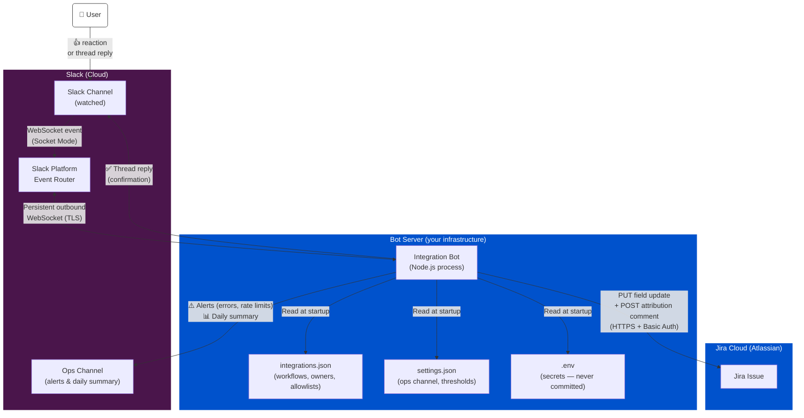
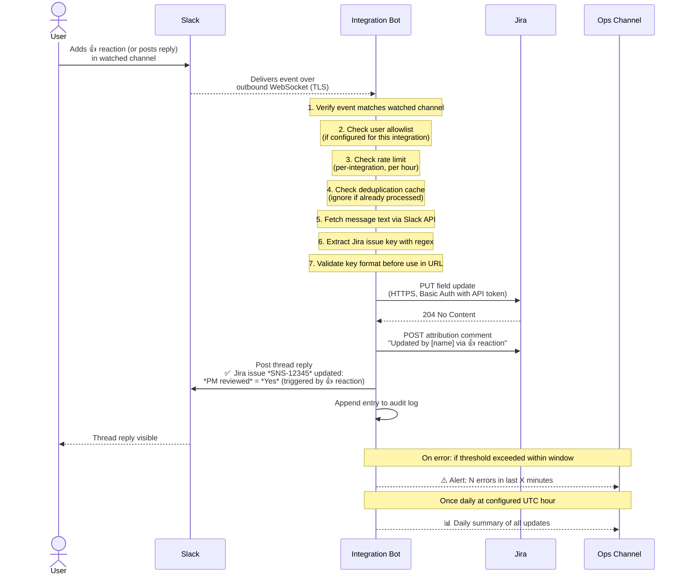

# Slack–Jira Integration Bot — Architecture & Security

## System Overview

---

## Event Flow (Step by Step)

---

## Component Inventory

| Component | Technology | Hosted by |
|---|---|---|
| Integration Bot | Node.js 22, @slack/bolt | Your server / VM / Docker |
| Workflow config | `config/integrations.json` | Your server (gitignored) |
| Operational settings | `config/settings.json` | Your server (gitignored) |
| Secrets | `.env` file or system env vars | Your server (gitignored) |
| Slack transport | Socket Mode WebSocket | Slack (cloud) |
| Jira API | REST API v3, HTTPS | Atlassian (cloud) |

---

## Configuration Reference

### `config/settings.json`
Global operational settings. Not integration-specific.

| Field | Description | Default |
|---|---|---|
| `opsChannelId` | Slack channel ID for alerts and daily summary | required |
| `alerting.errorThreshold` | Errors within window before an alert is posted | `3` |
| `alerting.errorWindowMinutes` | Rolling window for error counting (minutes) | `5` |
| `rateLimiting.defaultPerHour` | Default update cap per integration per hour | `20` |
| `dailySummary.enabled` | Whether to post a daily summary | `true` |
| `dailySummary.utcHour` | Hour (UTC, 0–23) at which to post the summary | `7` |

### `config/integrations.json`
One entry per named workflow.

| Field | Description | Required |
|---|---|---|
| `name` | Unique identifier for this workflow | ✅ |
| `owner` | Email or name of the person responsible for this integration | ✅ |
| `slackChannelId` | Slack channel ID to watch | ✅ |
| `jiraFieldId` | Jira field ID to update (e.g. `customfield_10000`) | ✅ |
| `jiraFieldName` | Human-readable field label shown in confirmations | ✅ |
| `jiraFieldValue` | Value to set on the field | ✅ |
| `jiraFieldType` | `select` / `text` / `array` / `raw` | `select` |
| `triggers` | `["reaction"]`, `["reply"]`, or both | ✅ |
| `allowedSlackUserIds` | Allowlist of Slack user IDs. Empty = all channel members | `[]` |
| `rateLimitPerHour` | Max updates per hour for this integration | `defaultPerHour` |

---

## Security Measures

### 1. No Inbound Network Exposure
The bot uses **Slack Socket Mode** — it opens an outbound WebSocket connection to Slack, not the other way around. This means:
- **No open TCP ports** on your server
- **No public URL** required
- **No SSL certificate** to manage
- Firewall rules only need to allow outbound HTTPS (port 443)

### 2. Secrets Never Touch Source Control
Credentials are stored in a `.env` file and loaded at runtime via environment variables. The `.env`, `config/integrations.json`, and `config/settings.json` files are all listed in `.gitignore`. Only `.example` templates (with no real values) are version-controlled. Any change to a live config requires a deliberate update on the server.

### 3. Slack Request Authenticity
Every event delivered by Slack is automatically verified by the `@slack/bolt` SDK using the **Slack Signing Secret**. Events from any other source (e.g. an attacker replaying a request) are rejected before any application code runs.

### 4. Jira Issue Key Validation
Before any user-supplied text is used in a Jira API URL path, it is validated against the strict regular expression `^[A-Z][A-Z0-9_]+-\d+$`. This prevents **path traversal / injection attacks** (e.g. a Slack message containing `../../admin` cannot be used to construct a malicious URL).

### 5. User Allowlist (Authorization)
Each integration can define an `allowedSlackUserIds` list. When set, only those Slack users can trigger updates — anyone else in the channel is silently ignored. The Slack channel itself remains a first layer of access control (only members can post or react); the allowlist is the second.

Leaving the list empty is an explicit opt-in to "all channel members are authorized", which is appropriate for tightly controlled private channels.

### 6. Deduplication Cache
Slack guarantees **at-least-once** event delivery. The bot maintains an in-memory cache (5-minute TTL) of processed events. Duplicate deliveries are detected and discarded, preventing the same user action from triggering multiple Jira writes.

### 7. Rate Limiting
Each integration has a configurable **per-hour update cap** (`rateLimitPerHour`). Events beyond the cap are dropped and an alert is posted to the ops channel. This prevents runaway automation from making unbounded changes to Jira.

### 8. Audit Trail (Dual-Layer)
Every successful update is recorded in two places:

- **Jira attribution comment**: posted directly on the issue at the time of the change — records who triggered it, from which integration, and via which action. This is the permanent, queryable record inside Jira.
- **Daily Slack summary**: posted once per day to the ops channel, listing every update made in the past 24 hours (integration, issue key, field change, triggering user, timestamp) and any failures.

### 9. Alerting & Operational Visibility
The bot posts to the ops channel when:
- An integration exceeds its error threshold within the rolling window (configurable)
- An integration's rate limit is reached

This gives the owner immediate visibility into misuse or operational issues without requiring log access.

### 10. Request Timeouts
All outbound HTTP requests to the Jira API have a **10-second timeout**. This prevents a slow or unresponsive Jira instance from hanging the bot process.

### 11. Minimal Logging — No Sensitive Data
Structured JSON logs (via `pino`) record:
- Which integration was triggered and by whom (display name only)
- Which Jira issue key was updated
- HTTP status codes on failure

Logs never contain: Slack message text, API tokens, user email addresses, or Jira response bodies.

### 12. Process Isolation
When deployed via the provided `systemd` unit file:
- **`User=appuser`** — dedicated non-root service account
- **`NoNewPrivileges=true`** — the process cannot escalate its own privileges
- **`ProtectSystem=strict`** — the process cannot write to system directories
- **`PrivateTmp=true`** — isolated `/tmp` namespace

When deployed via Docker, the `Dockerfile` runs the process as a non-root user inside an Alpine container.

### 13. Principle of Least Privilege
The Jira API token belongs to a **dedicated automation account** (not a personal account), scoped to only the projects and fields it needs to update. Revoking it has no impact on any human user's access.

Required Slack OAuth scopes:
- `channels:history` — read messages in watched channels
- `reactions:read` — receive reaction events
- `chat:write` — post confirmation replies and ops alerts
- `users:read` / `users:read.email` — resolve display names for audit trail and attribution

### 14. Governance
Adding or changing an integration requires:
1. Editing `config/integrations.json` on the server (not a code change)
2. Restarting the bot process to reload config
3. The named `owner` field in each integration establishes accountability for that workflow

New integration types or code changes must go through the repository's pull request process and be reviewed before deployment.

---

## Threat Model Summary

| Threat | Mitigation |
|---|---|
| Stolen API token used to call Jira directly | Dedicated automation account; revokable without user impact |
| Attacker sends fake Slack events to the bot | Not possible — bot is outbound only; no inbound port exists |
| Malicious Slack message injecting into Jira URL | Issue key regex validation rejects any non-conforming string |
| Unauthorized Slack user triggering updates | Per-integration `allowedSlackUserIds` allowlist |
| Runaway automation making unbounded Jira changes | Per-integration hourly rate limit with ops channel alert |
| Same event processed twice (Slack retry) | Deduplication cache with 5-minute TTL |
| Secrets committed to git | `.env`, `integrations.json`, `settings.json` are gitignored |
| No record of who changed what | Jira attribution comment + daily Slack summary |
| Bot process escaping its container / VM | Non-root user, `ProtectSystem=strict`, `NoNewPrivileges=true` |
| Token or message content leaked via logs | Logs contain only display names, issue keys, and HTTP status codes |
| Unowned integration causing undetected issues | `owner` field required per integration; logged at startup |
