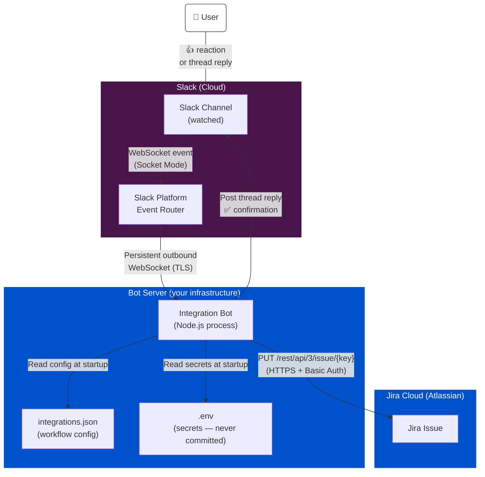
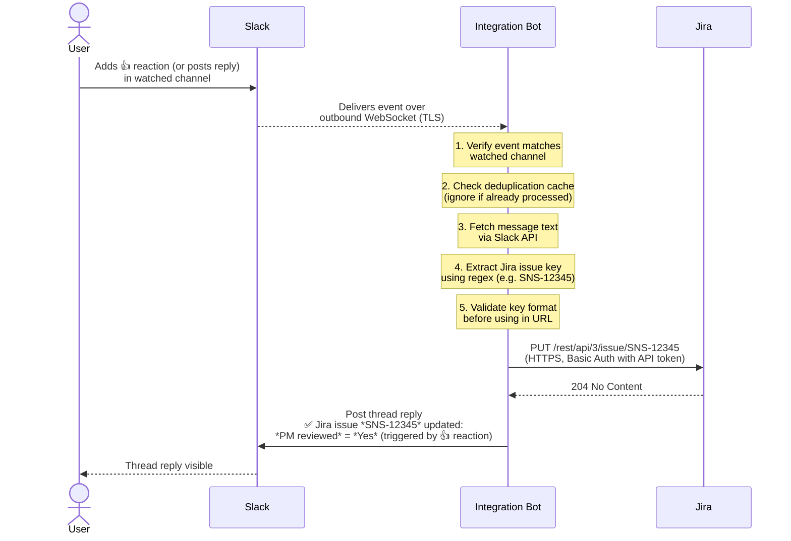

# Slack–Jira Integration Bot — Architecture & Security

## System Overview

---

## Event Flow (Step by Step)

---

## Component Inventory

| Component | Technology | Hosted by |
|---|---|---|
| Integration Bot | Node.js 22, @slack/bolt | Your server / VM / Docker |
| Workflow config | `config/integrations.json` | Your server (not in git) |
| Secrets | `.env` file or system env vars | Your server (not in git) |
| Slack transport | Socket Mode WebSocket | Slack (cloud) |
| Jira API | REST API v3, HTTPS | Atlassian (cloud) |

---

## Security Measures

### 1. No Inbound Network Exposure
The bot uses **Slack Socket Mode** — it opens an outbound WebSocket connection to Slack, not the other way around. This means:
- **No open TCP ports** on your server
- **No public URL** required
- **No SSL certificate** to manage
- Firewall rules only need to allow outbound HTTPS (port 443)

### 2. Secrets Never Touch Source Control
Credentials are stored in a `.env` file and loaded at runtime via environment variables. Both the `.env` file and the deployment-specific `config/integrations.json` are listed in `.gitignore` and will never be committed to the repository. Only `.example` templates (with no real values) are version-controlled.

### 3. Slack Request Authenticity
Every event delivered by Slack is automatically verified by the `@slack/bolt` SDK using the **Slack Signing Secret**. Events from any other source (e.g. an attacker replaying a request) will be rejected before any application code runs.

### 4. Jira Issue Key Validation
Before the bot uses any user-supplied text in a Jira API URL path, it validates the extracted issue key against the strict regular expression `^[A-Z][A-Z0-9_]+-\d+$`. This prevents **path traversal / injection attacks** (e.g. a Slack message containing `../../admin` cannot be used to construct a malicious URL).

### 5. Deduplication Cache
Slack guarantees **at-least-once** event delivery, meaning the same event can arrive more than once. The bot maintains an in-memory cache (5-minute TTL) of processed events. Duplicate deliveries are detected and silently discarded, preventing a Jira field from being written multiple times for the same user action.

### 6. Request Timeouts
All outbound HTTP requests to the Jira API have a **10-second timeout**. This prevents a slow or unresponsive Jira instance from causing the bot process to hang indefinitely.

### 7. Minimal Logging — No Sensitive Data
Logs record only:
- Which integration was triggered
- Which Jira issue key was updated
- HTTP status codes on failure

Logs never contain: Slack message text, API tokens, user email addresses, or Jira response bodies.

### 8. Process Isolation (systemd)
When deployed via the provided `systemd` unit file, the process runs with the following OS-level restrictions:
- **`User=appuser`** — dedicated non-root service account
- **`NoNewPrivileges=true`** — the process cannot escalate its own privileges
- **`ProtectSystem=strict`** — the process cannot write to system directories
- **`PrivateTmp=true`** — isolated `/tmp` namespace

When deployed via Docker, the `Dockerfile` runs the process as a non-root user (`appuser`) inside an Alpine container.

### 9. Principle of Least Privilege
The Jira API token used by the bot should belong to a **dedicated automation account** (not a personal account), with permissions scoped to only the projects and fields it needs to update. If the token is ever compromised, revoking it has no impact on any human user's access.

The Slack bot requires only the following OAuth scopes:
- `channels:history` — read messages in watched channels
- `reactions:read` — receive reaction events
- `chat:write` — post confirmation replies
- `users:read` / `users:read.email` — (reserved for future attribution feature)

---

## Threat Model Summary

| Threat | Mitigation |
|---|---|
| Stolen API token used to call Jira directly | Token belongs to a dedicated automation account; revokable without user impact |
| Attacker sends fake Slack events to the bot | Not possible — bot connects outbound; no inbound port exists |
| Malicious Slack message crafted to inject into Jira URL | Issue key regex validation rejects any non-conforming string |
| Same event processed twice (Slack retry) | Deduplication cache with 5-minute TTL |
| Secrets committed to git | `.env` and `integrations.json` are gitignored |
| Bot process escapes its container / VM | Non-root user, `ProtectSystem=strict`, `NoNewPrivileges=true` |
| Token leaked via application logs | Logs contain only issue keys and HTTP status codes |
